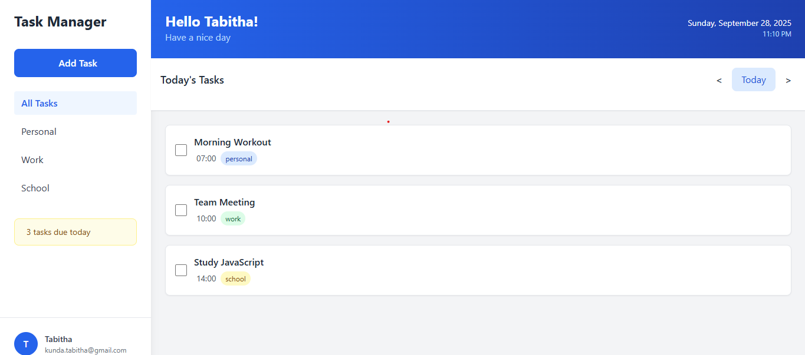

# task-management-board
#Description

This is a task management web application that helps users organize their daily tasks efficiently. Built with HTML5, Tailwind CSS and javascript, Tdashboard allows users to create, edit, delete, and track their task with a clean and morden interface.

# Features Implemented
- create Tasks
- Date Navigation
- Edit Tasks
- Delete Tasks
- Task Completion
- Task Categories
- Data Persistence
- Responsive Design
- Real timecLOCK

# Technologies Used
- HTML5
- Tailwind CSS
- Javascript
  
#https://tabytha01.github.io/task-management-board/

